### 手写一个自己的前端脚手架

#### 前言

很多小伙伴一直纠结什么脚手架？其实核心功能就是创建项目初始文件，那么问题来了，市面上的脚手架不够用？为什么自己写？

只要提到脚手架你就会想到，vue-cli、create-react-app他们的特点不用多说那就是专一
但是在公司中你会发现有以下一系列问题

- 业务类型多
- 多次造轮子，项目升级等问题
- 公司代码规范，无法统一

很多时候我们开发的时候需要新建项目，把已经有的项目代码复制一遍，保留基础功能。
那么我们可以自己定制化模板，自己实现一个属于自己的脚手架，来解决这些问题。
 
 在自己开发cli前，那么肯定要先看些优秀的cli是如何实现的。


#### 常用的npm包
- commander：nodeJs命令行接口的完整解决方案。
- inquirer：nodeJs 交互式命令行工具。
- handlebars：一个 javascript 语义话模版库。
- chalk：修改控制台中字符串的样式 字体样式(加粗、隐藏等) 字体颜色 背景颜色。
- download-git-repo：从github获取其他仓库下载模版代码。
- ora: 实现node.js 命令行环境的 loading效果， 和显示各种状态的图标等.


#### 开始搭建

创建 yuwenting-cli
初始化项目 
```
npm init -y

```
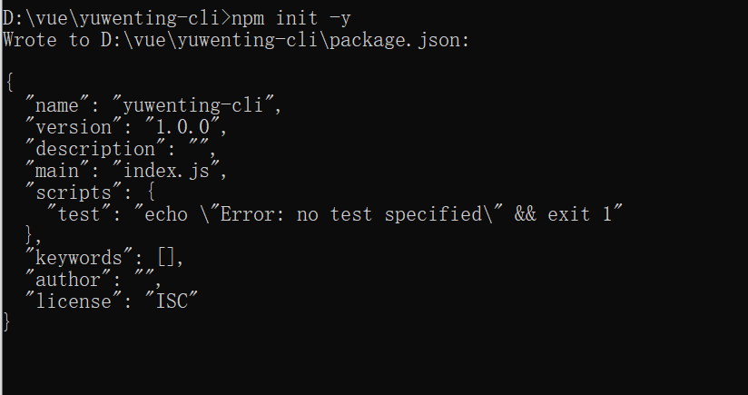

根目录下创建一个bin文件 然后新建一个yuwenting文件 

- 先创建可执行的脚本
#! /usr/bin/env node

- 配置package.json 中的bin字段
 - 配置一个
```
"bin":"./bin/yuwenting"
```
 - 配置多个 
```
"bin":{
  "yuwenting":"./bin/yuwenting",
  "yuwenting-cli":"./bin/yuwenting"
}
```

- npm link 可链接到本地环境

npm link --force  //强制链接过去

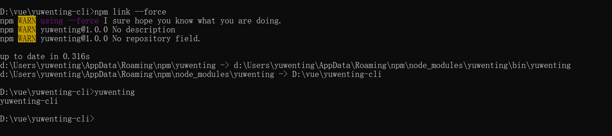

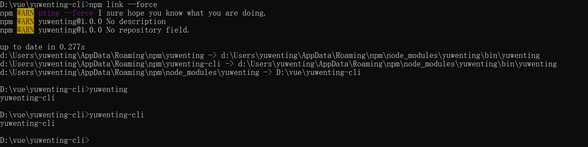


安装commander

```
npm install commander 

npm install  chalk //修改控制台中字符串的样式 字体样式(加粗、隐藏等) 字体颜色 背景颜色。

```

```
#! /usr/bin/env node //指定用node执行脚本文件

```

1).配置可执行命令 commander

```
//核心功能 1.创建项目 2.更改配置文件 3.ui界面 @vue/ui

const program = require('commander'); //引入插件
const chalk = require('chalk');

// 创建
program
    .command('create <app-name>') // 定义create子命令，<name>为必需参数可在action的function中接收，如需设置非必需参数，可使用中括号
    .description('create a new project') // 命令描述说明
    .option('-f,--force', 'ovrewrite target directory if it exists') //如果重名了 强制覆盖掉 // 配置参数，简写和全写中使用,分割
    .action((name, cmd) => {
        //这里可以对参数进行操作 
        console.log(name, cmd) //提取cmd中的属性

    })

// //yuwenting-cli config --get a 
// //yuwenting-cli config --set a 1 =>配置文件中
// //yuwenting-cli config -d
// 配置 
program
    .command('config [value]') // 定义config子命令，<value>为必需参数可在action的function中接收， 用于配置参数
    .description('inspect and modify the condig') //描述 修改配置文件
    .option('-g,--get <path>', 'get value from option') // 获取参数
    .option('-s,--set <path> <value>') //设置参数 
    .option('-d --delete <path>', 'delete option from config') //删除参数
    .action((value, cmd) => {
        //这里可以对参数进行操作 
        console.log(value, cmd);
    })

// ui界面
program
    .command('ui') // 定义ui子命令
    .description('start and open yuwenting-cli ui') //描述 打开一个类似 vue-ui的界面
    .option('-p,--port <port>', 'Port used for the UI Server') //端口
    .action((cmd) => {
        console.log(cmd)
    })

// 版本 以及 --help 提示 
program
    .version(`yuwenting-cli@${require('../package.json').version}`) //查询版本号
    .usage(`<command> [option]`) //--help 提示 命令 + 参数


program.on('--help', function () {
    console.log()
    console.log(`Run ${chalk.cyan(`yuwenting <command> --help`)} show details`)
    // console.log(chalk`{rgb(255,0,0).bold.bgRgb(255,255,255) Hello World}`);//文字加粗 背景白色 文字红色
    console.log()
})

//解析用户执行命令传入的参数
//这句话必须写在最后面   提供帮助  -h
program.parse(process.argv);


```
- 创建
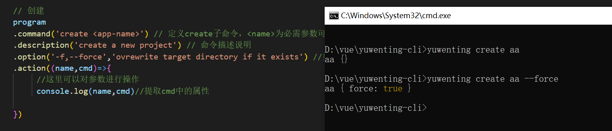

- 配置
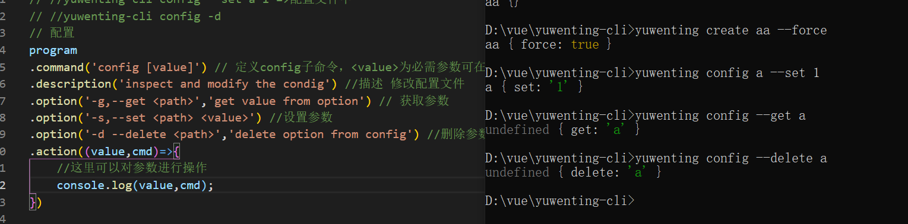

- 版本模块
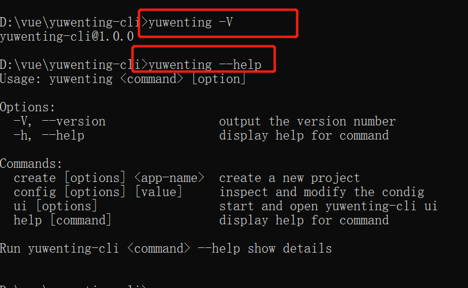

- 帮助
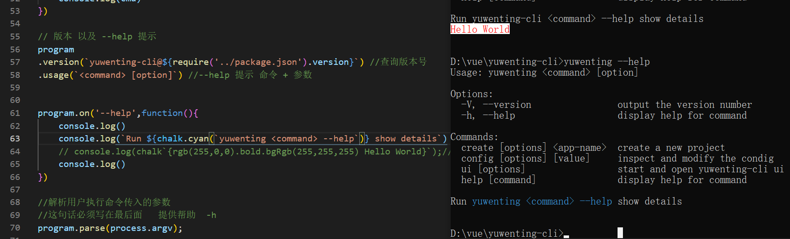

```
注意：
- 最新chalk5.0.0不支持在nodejs中require()导入，解决方法
  - 先卸载npm uninstall chalk
  - 在指定版本安装npm install chalk@4.0.0
```


2).我们要实现 脚手架 先做一个命令行交互的功能  inquirer

```
npm install fs-extra  //fs-extra模块是系统fs模块的扩展，提供了更多便利的 API，并继承了fs模块的 API 操作文件

npm install inquirer //nodeJs 交互式命令行工具


```

创建的项目的时候 如果有重复的增加询问 

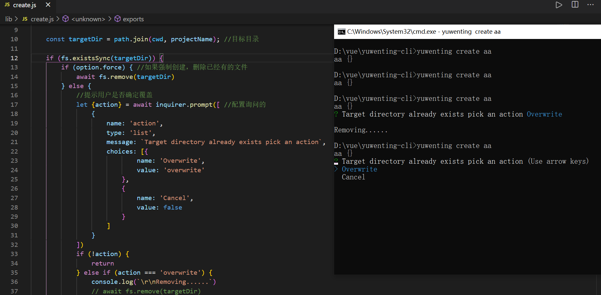

```
const path = require('path');
const fs = require('fs-extra');
const inquirer = require('inquirer');
//fs-extra模块是系统fs模块的扩展，提供了更多便利的 API，并继承了fs模块的 API 操作文件

const Creator = require('./creator')

module.exports = async function (projectName, option) {
    //创建项目 
    const cwd = process.cwd(); //获取当前命令执行时的工作目录
    const targetDir = path.join(cwd, projectName); //目标目录

    if (fs.existsSync(targetDir)) {
        if (option.force) { //如果强制创建，删除已经有的文件
            await fs.remove(targetDir)
        } else {
            //提示用户是否确定覆盖 
            let {action} = await inquirer.prompt([ //配置询问的
                {
                    name: 'action',
                    type: 'list',
                    message: `Target directory already exists pick an action`,
                    choices: [{
                            name: 'Overwrite',
                            value: 'overwrite'
                        },
                        {
                            name: 'Cancel',
                            value: false
                        }
                    ]
                }
            ])
            if (!action) {
                return
            } else if (action === 'overwrite') {
                console.log(`\r\nRemoving......`)
                // await fs.remove(targetDir)
            }
        }
    }

      //创建项目 new 一个类
    const creator = new Creator(projectName,targetDir);

    creator.create();//创建项目

}
```

3).将模板下载下来 download-git-repo

```
npm install download-git-repo //从github获取其他仓库下载模版代码

npm install axios

npm install ora // 实现node.js 命令行环境的 loading效果， 和显示各种状态的图标等.

```

//先封装一个loading

```
const ora = require('ora');//loading
async function sleep(n){
    return new promise((resolve,reject)=>setTimeout(resolve,n))
}

async function wrapLoading(fn,message,...args){
    const spinner = ora(message);
    spinner.start();//开启加载
    try{
        let repos = await fn(...args);
        spinner.succeed();
        return repos;
    }catch(e){
        spinner.fail('request failed,refetch... ')
        await sleep(1000);
        return wrapLoading(fn,message,...args)
    }
}
module.exports = {
    sleep,
    wrapLoading
}
```
开始创建模板 首先github api拉取文件 然后选择对应的仓库以及版本 下载到对应的文件夹

```
const {fetchRepoList,fetchTagList } = require('./request')
const Inquirer = require('inquirer');//交互
const {wrapLoading} = require('./util');
const downloadGitRepo = require('download-git-repo');//不支持promise
const util = require('util');
const path = require('path');


class Creator {
    constructor(projectName, targetDir) { //new 的时候会调用构造函数 参数（创建的名称，所在目录）
        this.name = projectName;
        this.target = targetDir;
        //此时的方法就是一个promise方法了
        this.downloadGitRepo = util.promisify(downloadGitRepo);
    }
    async fetchRepo(){
        //失败重新拉取
        let repos = await wrapLoading(fetchRepoList,'waiting fetch template');
        if(!repos) return;
        // console.log(repos);
        repos = repos.map(item=>item.name);
        let {repo} = await Inquirer.prompt({
            name:'repo',
            type:'list',
            choices:repos, // 所有仓库的名称
            message:'pleas choose a template to creata project'
        })
        // console.log(repo)
        return repo;

    }
    async fetchTag(repo){
        let tags = await wrapLoading(fetchTagList,'waiting fetch tag',repo);
        if(!tags) return;
        tags = tags.map(item=>item.name);
        let {tag} = await Inquirer.prompt({
            name:'tag',
            type:'list',
            choices:tags,//当前仓库对应的tags
            message:'pleas choose a tag to creata project'
        })
        return tag;
    }
    async download(repo,tag){
        //1.需求把拼接处的下载路径来
        //taiyangyexue/vue-templete#1.0 用户+仓库名称 + 版本
        let requestUrl = `taiyangyexue/${repo}${tag?'#'+tag:''}`
        //2.把资源下载到某个路径上 (git仓库地址,目标文件,回调)
        await this.downloadGitRepo(requestUrl,path.resolve(process.cwd(),`${this.name}@${tag}`));
        return this.target;
    }
    async create(){
        // console.log(this.name);//aa
        // console.log(this.target)//D:\vue\yuwenting-cli\aa
        //1).先去拉取当前组织下的模板
        let repo =  await this.fetchRepo();
        console.log(repo);//用户选择项目名称 模板 vue-templete
        //2).再通过模板找到版本号
        let tag = await this.fetchTag(repo);

        //3).下载
        await this.download(repo,tag)

    }
}
module.exports = Creator;
```

```
//通过axios来获取github上的对应的模板

const axios = require('axios');

axios.interceptors.response.use(res=>{
    return res.data;
})

async function fetchRepoList(){
    //通过配置文件拉取不同的仓库对应的用户下的文件
    return axios.get('https://api.github.com/users/taiyangyexue/repos');
}
async function fetchTagList(repo){
    //通过配置文件拉取不同的仓库对应的用户下文件的版本
    return axios.get(`https://api.github.com/repos/taiyangyexue/${repo}/tags`);
}
module.exports = {
    fetchRepoList,
    fetchTagList
}
```
github拉取过来的api 

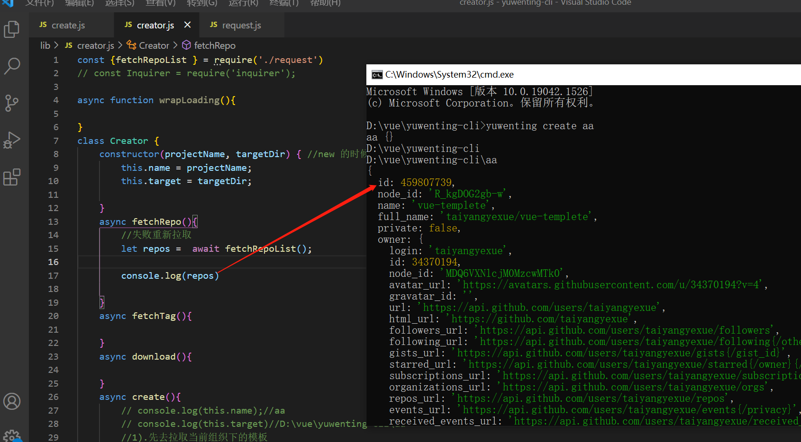


选择版本
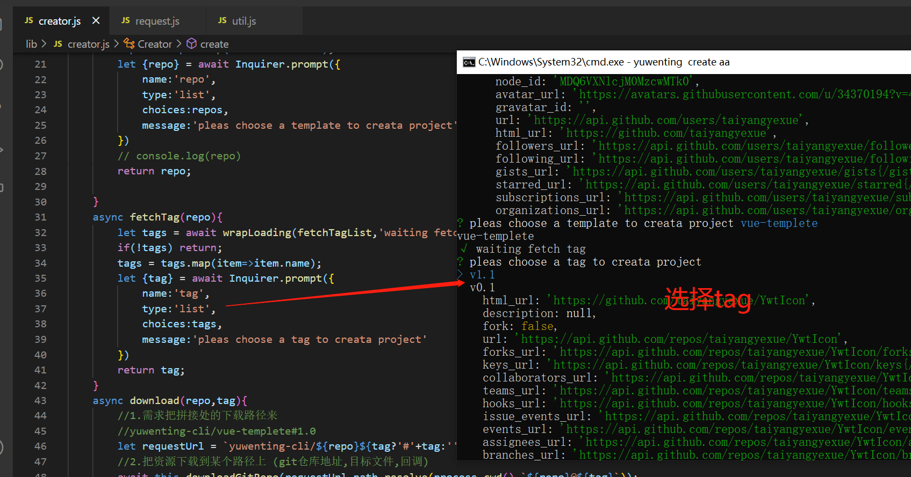

终版

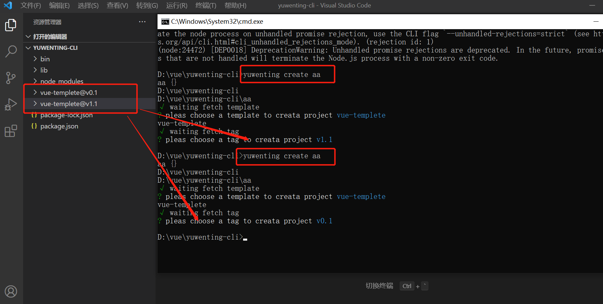


#### 发布到npm

```
- npm login 登陆, 没有账号,先注册账号

然后在项目根目录, - npm publish发布

注意如果package.json中的name如果和已发布的包重复,会报403错误

然后就可以在使用了, 全局安装
    npm i xxxTools -g;
    xxxTools create myAPP;

```


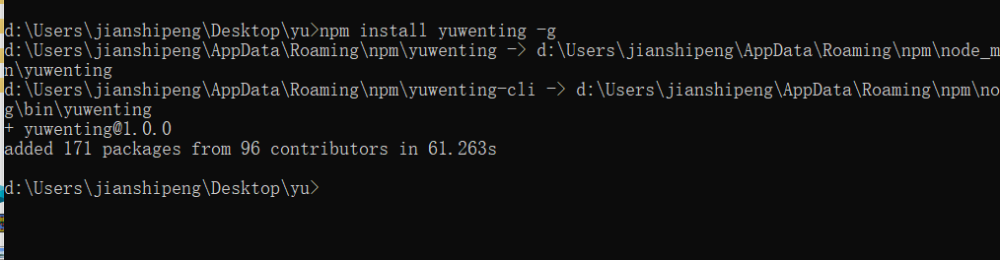


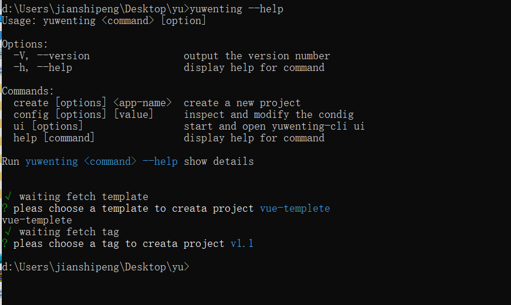


