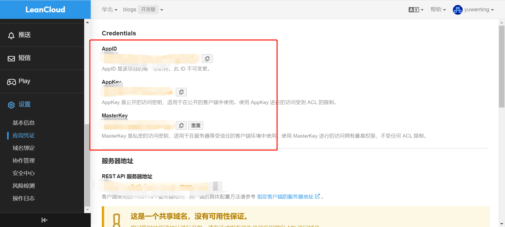

## VuePress 从零开始

```
VuePress官网：
https://vuepress.vuejs.org/zh/
```

###### VuePress 由两部分组成：一个以 Vue 驱动的主题系统的简约静态网站生成工具，和一个为编写技术文档而优化的默认主题。它是为了支持 Vue 子项目的文档需求而创建的。

###### 由 VuePress 生成的每个页面，都具有相应的预渲染静态 HTML，它们能提供出色的加载性能，并且对 SEO 友好。然而，页面加载之后，Vue 就会将这些静态内容，接管为完整的单页面应用程序(SPA)。当用户在浏览站点时，可以按需加载其他页面。

###### 请确保你的 Node.js 版本 >= 8.6。

#### 全局安装

```
yarn global add vuepress # 或者：npm install -g vuepress
```

<!--  -->

#### 创建文件

```
mkdir press
cd press
初始化项目
yarn init -y # 或者 npm init -y
yarn add -D vuepress@next
mkdir docs
mkdir .vuepress
cd .vuepress 创建config.js
```

#### 结构目录如下：

```
press
├─── docs
│   ├── README.md
│   └── .vuepress
│       ├── public
│       └── config.js
└── package.json
```

#### 修改配置文件 - config.js

```
module.exports = {
  themeConfig: {
    navbar: [
      // NavbarItem
      {
        text: 'Foo',
        link: '/foo/',
        children:[
          {
            text: 'Food',
            link: '/foo/food.md',
          }

        ]
      },
      // NavbarGroup
      {
        text: 'Group',
        children: ['/group/foo.md', '/group/bar.md'],
      },
      // 字符串 - 页面文件路径
      '/bar/README.md',
    ],
  },
}
```

#### 默认主题

###### 默认的主题提供了一个首页（Homepage）的布局 (用于 这个网站的主页)。想要使用它，需要在你的根级 README.md 的 YAML front matter 指定 home: true。以下是一个如何使用的例子：

```
---
home: true
heroImage: /favicon.ico
actionText: 快速上手 →
actionLink: /guide/
features:
- title: 简洁至上
  details: 以 Markdown 为中心的项目结构，以最少的配置帮助你专注于写作。
- title: Vue驱动
  details: 享受 Vue + webpack 的开发体验，在 Markdown 中使用 Vue 组件，同时可以使用 Vue 来开发自定义主题。
- title: 高性能
  details: VuePress 为每个页面预渲染生成静态的 HTML，同时在页面被加载的时候，将作为 SPA 运行。
footer: MIT Licensed | Copyright © 2018-present xxxxxx
---
```

#### 启动项目

```
cd docs
npm docs:dev
构建静态文件
npm docs:build
```


#### 配置评论插件
一个网站,莫过于内容的载体,令你三连击之外,有用户访问,并且能够与你进行互动,有反馈,才会有交流,添加评论,留言的功能也很重要
今天给大家介绍的是valine评论插件

##### 插件 Valine
⒈ 一款快速、简洁且高效的无后端评论系统

⒉ 官方文档:[valine](https://valine.js.org/quickstart.html#%E8%8E%B7%E5%8F%96APP-ID-%E5%92%8C-APP-Key)

在使用 valine 之前,先前往leancloud 注册账号(opens new window)

然后创建应用, 获取APP ID和APP KEY



安装-vuepress-plugin-comment
```
yarn add valine -D

yarn add -D  vuepress-plugin-comment
```
快速使用
在.vuepress下的config.js的plugin插件选项中进行配置
```
module.exports = {
  plugins: [
    [
      'vuepress-plugin-comment',
      {
        choosen: 'valine',
        // options选项中的所有参数，会传给Valine的配置
        options: {
          el: '#valine-vuepress-comment',
          appId: 'Your own appId',
          appKey: 'Your own appKey',
        },
      },
    ],
  ],
};
```
其中appid和appkey为你创建的应用的APP ID 和APP Key，把刚才获取到的秘钥复制过来即可,经过配置之后 


#### 部署上线

#### vuepress 文档部署到 github-pages Github Actions

#### 创建一个 deploy.sh

```
#!/usr/bin/env sh

# 确保脚本抛出遇到的错误
set -e

#cd D:/vue/press/docs/
# 生成静态文件
#vuepress build .
npm run docs:build
# 进入生成的文件夹
cd docs/.vuepress/dist

# 如果是发布到自定义域名
# echo 'www.example.com' > CNAME

git init
git add -A
git commit -m 'deploy'

# 如果发布到 https://<USERNAME>.github.io
# git push -f git@github.com:<USERNAME>/<USERNAME>.github.io.git master
git push -f git@github.com:taiyangyexue/yuwenting.github.io.git main:gh-pages

# 如果发布到 https://<USERNAME>.github.io/<REPO>
# git push -f git@github.com:<USERNAME>/<REPO>.git master:gh-pages

cd -
```

#### 设置 package.json

```
{
    "scripts": {
        "deploy": "bash deploy.sh"
      },
}
运行npm run deploy 即可自动构建部署到github上。
```

#### 在.github/workflow/下新建 deploy.yml

```
# This is a basic workflow to help you get started with Actions

name: CI

# Controls when the workflow will run
on:
  # Triggers the workflow on push or pull request events but only for the main branch
  push:
    branches: [ main ]
  pull_request:
    branches: [ main ]

  # Allows you to run this workflow manually from the Actions tab
  workflow_dispatch:

# A workflow run is made up of one or more jobs that can run sequentially or in parallel
jobs:
  # This workflow contains a single job called "build"
  build:
    # The type of runner that the job will run on
    runs-on: ubuntu-latest

    # Steps represent a sequence of tasks that will be executed as part of the job
    steps:
     - name: Checkout
       uses: actions/checkout@v2
       with:
         persist-credentials: false
     - name: Install & Build # 指令
       run: |
          npm install
          npm run docs:build

     - name: Build and Deploy Repo
       uses: JamesIves/github-pages-deploy-action@releases/v4
       with:
         ACCESS_TOKEN: ${{ secrets.ACCESS_TOKEN }} # Settings > Secret 建立的 ACCESS_TOKEN，推同个 repo 可以不需要
         BRANCH: gh-pages
         FOLDER: docs/.vuepress/dist
```

###### 上面有个需要注意的点，就是 Deploy 下，需要填写一个秘钥，需要在 github 上申请一个 ACCESS_TOKEN

###### 如果上面都配置好了，可以执行 push 操作了。正常情况下是能够执行成功的。

#### 问题

###### 1..yml 格式问题

###### 2..vuepress 下面 config.js 配置路径问题 把 base 改下


部署自动化deploy.sh
在项目根目录创建deploy.sh，写入以下内容：

# 确保脚本抛出遇到的错误
set -e

# 编译生成静态文件
npm run build

# 进入生成的文件夹
cd docs/.vuepress/dist

git init
git add -A
git commit -m 'deploy'

# 发布到上面建立的第一个仓库
git push -f git@github.com:USERNAME/USERNAME.github.io.git master

# 返回上一次工作目录
cd -
在package.json的scripts中添加命令：

{
  ...
  "scripts": {
    "dev": "vuepress dev docs",// 开发环境运行
    "build": "vuepress build docs",// 打包生成部署环境的文件
    // 自动执行deploy.sh脚本，执行自动编译并将dist上传至USERNAME.github.io仓库
    "deploy": "sudo bash deploy.sh",
  }
  ...
}
这里前面加了一个sudo是因为macOS中执行需要管理员权限，windows下就不用加了，另外windows下执行的话需要在powershell中执行，cmd是不认得这个bash的。

WARNING

差不多一个博客项目就搭建完了，另外还搭建了自动化部署的一整套流程。

写完博客后，在本地运行npm run dev，当然也可以边写边运行，保存后通过热更新可以直接看到效果。
检查无误后执行npm run deploy，就可以执行deploy.sh脚本执行编译和自动部署。
另外Typora这个Markdowm编写神器是非常好用👍。