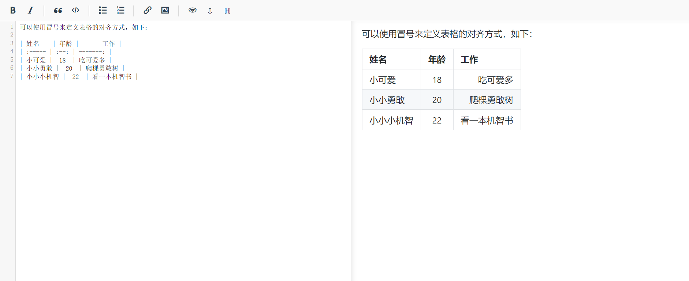
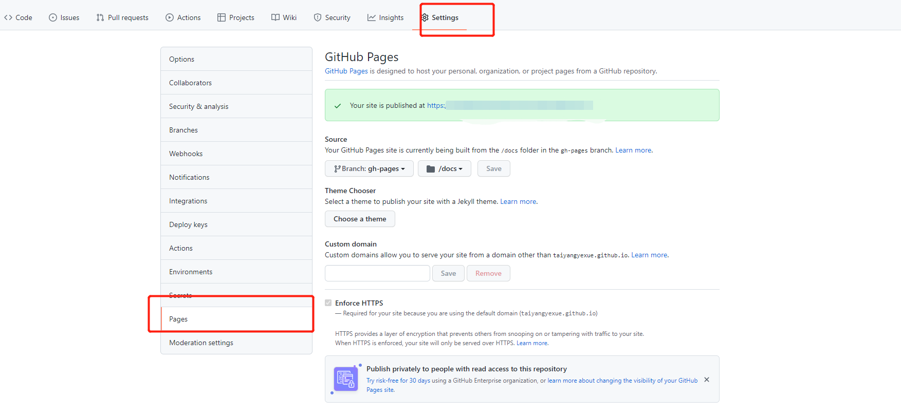

## VuePress + GitHub Actions 从零开始
### 前言
只听过vue，没听过vuepress？它可是新的vue全家桶成员之一，尤雨溪大神于2018年4月12日推出。
vuepress用于迅速搭建技术文档网站与个人博客，简单快捷。


```
VuePress官网：
https://vuepress.vuejs.org/zh/
```

VuePress 由两部分组成：一个以 Vue 驱动的主题系统的简约静态网站生成工具，和一个为编写技术文档而优化的默认主题。它是为了支持 Vue 子项目的文档需求而创建的。

 由 VuePress 生成的每个页面，都具有相应的预渲染静态 HTML，它们能提供出色的加载性能，并且对 SEO 友好。然而，页面加载之后，Vue 就会将这些静态内容，接管为完整的单页面应用程序(SPA)。当用户在浏览站点时，可以按需加载其他页面。

### 亮点


### 同类模块横向对比
- Nuxt: VuePress 能做的事情，Nuxt 理论上确实能够胜任，但Nuxt 是为构建应用程序而生的
- VuePress: 专注在以内容为中心的静态网站上，同时提供了一些为技术文档定制的开箱即用的特性

- Docsify / Docute:
同样都是基于 Vue，然而它们都是完全的运行时驱动，因此对 SEO 不够友好

- Hexo:
主题系统太过于静态以及过度地依赖纯字符串, 而不是基于Vue。同时，Hexo 的 Markdown 渲染的配置也不是最灵活的

- GitBook：
当文件很多时，每次编辑后的重新加载时间长
默认主题导航结构也比较有限制性
主题系统也不是 Vue 驱动的
GitBook 团队更专注于将其打造为一个商业产品而不是开源工具

### 开始搭建 前提准备
安装NodeJs
检测 NodeJs 是否安装成功,可在命令行终端输入node -v
同时查看一下 npm 的版本npm -v(在安装 Node 完后,npm 是自动就安装上了的,集成在了 Node 运行坏境里)

请确保你的 Node.js 版本 >= 8.6

安装git bash:用于向 github 提交代码

vscode 插件商店里安装markdown,markdown Preview插件


### 全局安装

```
yarn global add vuepress # 或者：npm install -g vuepress
```
- 若是使用 yarn 安装,需要先全局安装 yarn(npm install -g yarn)
- 若是使用 npm 全局安装,请确保你的 Node.js 版本 >= 8
- 如果你的现有项目依赖了 webpack 3.x，推荐使用 Yarn而不是npm 来安装 VuePress。因为在这种情形下，npm 会生成错误的依赖树

<!--  -->

### 创建文件

```
mkdir press
cd press
初始化项目
yarn init -y # 或者 npm init -y
yarn add -D vuepress@next
mkdir docs
mkdir .vuepress
cd .vuepress 创建config.js
```

经过yarn init -y后,会生成一个package.json文件

紧接着，在 package.json里加一些脚本,配置启动命令

```
"scripts": {
    "docs:dev": "vuepress dev docs",
    "docs:build": "vuepress build docs"
  }
```
这个也可以简化成:
```
"scripts": {
    "dev": "vuepress dev docs",
    "build": "vuepress build docs"
  }
```
启动项目: 
```
npm run docs:dev
```
这条命令相当于
```
vuepress dev docs
```

打包项目: 
```
npm run build
```
这条命令相当于 
```
vuepress build docs
```

这个.vuepress主要就是我们用于存放全局的配置、组件、静态资源等与VuePress相关的文件配置都将会放在这里,
具体更详细配置说明可见官网:[基本配置](https://v2.vuepress.vuejs.org/zh/reference/config.html#%E7%AB%99%E7%82%B9%E9%85%8D%E7%BD%AE) 


官方只有推荐目录结构，并没有现成的cli，所以需要通过命令行或手动创建如下结构：

```
press
├─── docs
│   ├── README.md
│   └── .vuepress
│       ├── public
│       └── config.js
└── package.json
```

修改配置文件 - config.js

```
module.exports = {
    base: '/yuwenting.github.io/',
    title: 'Hello VuePress',
    description: 'Hello, my friend!',
    head: [
        ['link', {
            rel: 'icon',
            href: `/favicon.ico`
        }]
    ],
    dest: './docs/.vuepress/dist',
    evergreen: true,
    themeConfig: {
        search: false,
        navbar: [{
                text: 'home',
                link: '/'
            },
            {
                text: 'New',
                link: '/new/new.md',
            },
        ],
        sidebar: [{
            text: "web",
            link: "/web/index.md",
            children: [{
                    text: "web",
                    link: "/web/demo.md"
                },
            ]
        }, ],
    }
}
```

### 默认主题

默认的主题提供了一个首页（Homepage）的布局 (用于 这个网站的主页)。想要使用它，需要在你的根级 README.md 的 YAML front matter 指定 home: true。以下是一个如何使用的例子：

```
---
home: true
heroImage: /favicon.ico
actionText: 快速上手 →
actionLink: /guide/
features:
- title: 简洁至上
  details: 以 Markdown 为中心的项目结构，以最少的配置帮助你专注于写作。
- title: Vue驱动
  details: 享受 Vue + webpack 的开发体验，在 Markdown 中使用 Vue 组件，同时可以使用 Vue 来开发自定义主题。
- title: 高性能
  details: VuePress 为每个页面预渲染生成静态的 HTML，同时在页面被加载的时候，将作为 SPA 运行。
footer: MIT Licensed | Copyright © 2018-present xxxxxx
---
```

### 启动项目

```
cd docs
npm docs:dev
构建静态文件
npm docs:build
```
### 变更主题（可选）

- 可以在npm中寻找自己喜欢的主题，其中以 @vuepress/theme- 开头的主题是官方维护的主题：


在config.js中设置：
```
module.exports = {
  theme: 'vuepress-theme-xx'
}
```
举例：
```
yarn add vuepress-theme-yuu
# or npm install vuepress-theme-yuu
```
```
module.exports = {
	theme: 'yuu',
}

```
- 开发主题：
npm上也没有合适的主题？安排！
那咱们就自己开发一个主题，感兴趣的同学可以自行查看官方文档-开发主题
https://v2.vuepress.vuejs.org/zh/advanced/theme.html

### MarkDown语法简介
为了后续更好的学习，我们需要先了解一下MarkDown相关语法。
MarkDown是一种轻量级标记语言，使用易读易写的纯文本格式编写文档。2004年由约翰·格鲁伯创建。使用MarkDown编写的文档可以导出HTML、Word、图像、PDF、Epub等多种格式的文档。MarkDown编写的文档，后缀名为.md或.markdown。

 对于MarkDown的编写，我们可以下载Typora软件玩一下，当然也可以直接在Visual Studio Code中写或者使用在线工具：https://markdown.com.cn/editor/
 
- 标题
# 我是一级标题
## 我是二级标题
### 我是三级标题
#### 我是四级标题
##### 我是五级标题
###### 我是六级标题


- 字体
粗体、斜体、粗体和斜体，删除线，需要在文字前后加不同的标记符号。如下：

    **这个是粗体**

    *这个是斜体*

    ***这个是粗体加斜体***

    ~这里想用删除线~~

   注：如果想给字体换颜色、字体或者居中显示，需要使用内嵌HTML来实现


- 无序列表

    无序列表的使用，在符号`-`后加空格使用。如下：

    - 无序列表 1
    - 无序列表 2
    - 无序列表 3

    如果要控制列表的层级，则需要在符号`-`前使用空格。如下：

    - 无序列表 1
    - 无序列表 2
      - 无序列表 2.1
      - 无序列表 2.2


- 有序列表

    有序列表的使用，在数字及符号`.`后加空格后输入内容，如下：


- 表格

  可以使用冒号来定义表格的对齐方式，如下：

| 姓名   | 年龄 |     工作 |
| :----- | :--: | -------: |
| 小可爱 |  18  | 吃可爱多 |
| 小小勇敢 |  20  | 爬棵勇敢树 |
| 小小小机智 |  22  | 看一本机智书 |



- 图片
    Markdown 使用了类似链接的语法来插入图片, 包含两种形式: 内联 和 引用。


### 在 markdown 中使用 vue (可选)

首先安装
```
npm i -D @vuepress/plugin-register-components@next

```
组件目录：
```sh
components
├─ MyButton.vue
└─ Baz.vue
```
配置
```
plugins: [
        [
            '@vuepress/register-components',
            {
              components: {
                MyButton: path.resolve(__dirname, './components/MyButton.vue'),
              },
            },
          ],
      ]
  ```
  使用 
  ```
  <MyButton></MyButton>

  ```
以上就能显示正常了

### 部署上线

vuepress 文档部署到 github-pages Github Actions

GitHub Actions 是 GitHub 的持续集成服务
具体入门教程参考:[教程](http://www.ruanyifeng.com/blog/2019/09/getting-started-with-github-actions.html?20191227113947#comment-last) 

首先，github上创建一个仓库 如下：


需要获取token，后面会用到,
将这两个token同时储存到github仓库的Settings/Secrets里面。
变量名可以随便取，但是注意要和后面的deploy.yml文件内的变量名一致，这里取的是ACCESS_TOKEN。


GitHub Actions 的配置文件叫做 workflow 文件，存放在代码仓库的.github/workflows目录。

#### 在.github/workflow/下新建 deploy.yml
workflow 文件采用 YAML 格式，文件名可以任意取，但是后缀名统一为.yml，比如deploy.yml。一个库可以有多个 workflow 文件。GitHub 只要发现.github/workflows目录里面有.yml文件，就会自动运行该文件。

我的deploy.yml文件：

```
# This is a basic workflow to help you get started with Actions

name: CI

# Controls when the workflow will run
# 在main分支发生push事件时触发。
on:
  # Triggers the workflow on push or pull request events but only for the main branch
  push:
    branches: [ main ]
  pull_request:
    branches: [ main ]

  # Allows you to run this workflow manually from the Actions tab
  workflow_dispatch:

# A workflow run is made up of one or more jobs that can run sequentially or in parallel
jobs:  # 工作流
  # This workflow contains a single job called "build"
  build:
    # The type of runner that the job will run on
    runs-on: ubuntu-latest  #运行在虚拟机环境ubuntu-latest

    # Steps represent a sequence of tasks that will be executed as part of the job
    steps:
     - name: Checkout
       uses: actions/checkout@v2
       with:
         persist-credentials: false
     - name: Install & Build # 指令
       run: |
          npm install
          npm run docs:build

     - name: Build and Deploy Repo
       uses: JamesIves/github-pages-deploy-action@releases/v4
       with:
         ACCESS_TOKEN: ${{ secrets.ACCESS_TOKEN }} # Settings > Secret 建立的 ACCESS_TOKEN，推同个 repo 可以不需要
         BRANCH: gh-pages
         FOLDER: docs/.vuepress/dist
```

这个配置文件会在我push提交代码到主分支时触发工作，运行环境是ubuntu-latest，工作步骤：

- 获取仓库源码

- 安装nodejs，打包项目有用到nodejs

- 把token设置到环境变量，安装项目依赖,提交到各自的仓库，完成部署。

如果上面都配置好了，可以执行 push 操作了。正常情况下是能够执行成功的。

查看是否执行成功


访问github链接 查看刚刚部署的网站



```
注意事项

     1..yml 格式问题

     2..vuepress 下面 config.js 配置路径问题 把 base 改下
```
